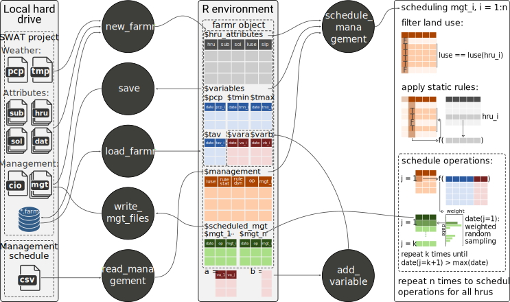

# SWATfarmR 

`SWATfarmR` is a pre-processing tool for the scheduling of farm management operations for SWAT+ and SWAT2012 projects. `SWATfarmR` develops management schedules for each HRU of a SWAT model setup based on user defined management tables. The user can define rules that control the timing of operations. These rules can include information on temporal constraints, an HRU's spatial properties, or any climatic or other external variable to control the scheduling of an operation. The concept of the `SWATfarmR` is comparable to the decision tables concept that is implemented in SWAT+ ([Arnold et al., 2018](https://doi.org/10.3390/w10060713)). The main difference between these two concepts is that `SWATfarmR` develops the management operation schedules in a model pre-processing, whereas the decision tables are evaluated during the model execution. 

## Installation

You can install `SWATfarmR` from the package's GitHub repository: 

```r
# If the package 'remotes' is not installed run first:
install.packages("remotes")

remotes::install_github("chrisschuerz/SWATfarmR")
```

`SWATfarmR` will be constantly updated and new features will find their way into the `R` package from time to time. Any updates and fixed issues are documented in the [Changelog](https://chrisschuerz.github.io/SWATfamrR/news/index.html). Bugs and open issues are documented in the `R` package's [issue section](https://github.com/chrisschuerz/SWATfarmR/issues). If you encounter any issues, or want to suggest any new features I encourage you to do so there. Please also check the [closed issues](https://github.com/chrisschuerz/SWATfarmR/issues?q=is%3Aissue+is%3Aclosed) to see if your question is related to anything that was already solved before.


## Package workflow

`SWATfarmR` works with a SWAT project that is located on the local hard drive. [`new_farmr()`](https://chrisschuerz.github.io/SWATfarmR/reference/new_farmr.html) initiates a `SWATfarmR` project which generates a *'farmr object'* in the `R` environment and a '\*.farm' file in the SWAT project folder that is linked to the project in the `R` environment. The initiated *'farmr object'* reads SWAT project attributes such as weather data and HRU attributes from the text input files of a model setup which will be later used in the management scheduling. Additionally to the SWAT model attributes the *'farmr object'* includes functions to process the farm management scheduling for the SWAT project. For all SWAT land uses for which management operations should be scheduled the user must define sequences of management operations and rules that control the scheduling in a management schedule '\*.csv' file. With the function `.$read_management()` the table is loaded into the  *'farmr object'*. By default the rules to control the scheduling of management operations can use the variables `pcp` (daily precipitation) and `tav`, `tmn`, and `tmx` (daily average, min, and max temperature). If further variables should be used to control the scheduling these can be added with the function `.$add_variable()`.  With `.$schedule_operations()` the sequences of farm management operations that were defined in the management schedule table are scheduled for all HRUs (if for the land use of an HRU a farm management was defined). After the operation scheduling the farm management schedules can be written into the SWAT project's text input files using the function `.$write_operations()`. You can continue working on your `SWATfarmR` project any time as all working steps are saved to the '\*.farm' file in the SWAT project folder. If you want to manually save the status of your project you can do this with `.$save()`. To load the `SWATfarmR` project and continue working in `R` use the function `load_farmr()`.


